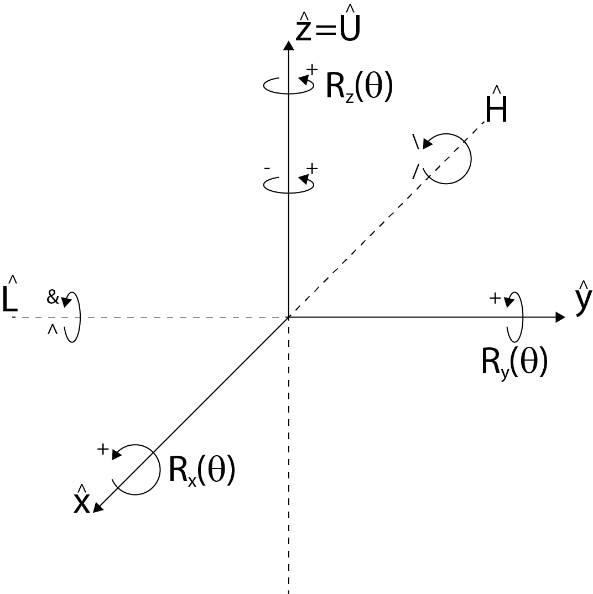
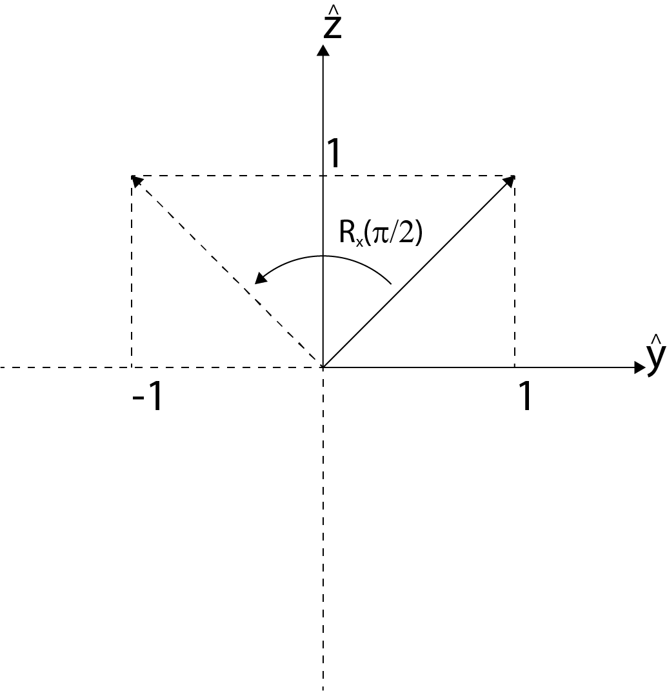
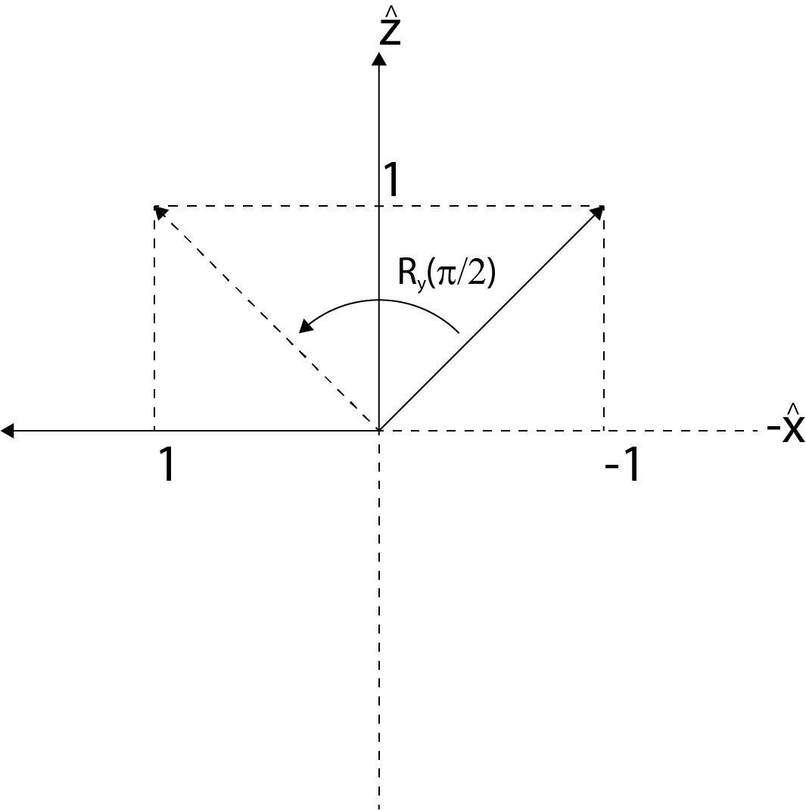

# Turtle Interpretation of Symbols 

## Convention for Rotations (The Wikipedia convention)
We adopt the following convention for rotations of the turtle (referred to as the "Wikipedia convention," because it is [the same convention Wikipedia uses](https://en.wikipedia.org/wiki/Rotation_matrix#Basic_3D_rotations) in their discussion on rotation matrices)

```math
\begin{align}
\begin{split}
R_x(\theta) &= 
\left[\!\begin{array}{c c c}
{1} & {0} & {0}\\
{0} & {\cos\theta} & {-\sin\theta}\\
{0} & {\sin\theta} & {\cos\theta}
\end{array}
\!\right]\\
\\
R_y(\theta) &= \left[\!\begin{array}{c c c}
{\cos\theta} & {0} & {\sin\theta}\\
{0} & {1} & {0}\\
{-\sin\theta} & {0} & {\cos\theta}
\end{array}
\!\right] \\
\\
R_z(\theta) &= \left[\!\begin{array}{c c c}
{\cos\theta} & {-\sin\theta} & {0}\\
{\sin\theta} & {\cos\theta} & {0}\\
{0} & {0} & {1}
\end{array}
\!\right] 
\end{split}
\end{align}
```

These definitions represent **counter-clockwise** rotations about their corresponding axes, when viewing them end-on. 

<center></center>
<center>Turtle Rotation Convention</center>

The following examples apply each of these rotations to a simple 45° vector in the plane of rotation, to emphasize their direction.

- Rotation of the vector $`(0,1,1)`$ by $`R_x(\pi/2)`$ produces the vector $`(0,-1,1)`$, equivalent to a counter-clockwise rotation of the vector about the x-axis. 

```math
R_x(\pi/2) = 
\left[\!\begin{array}{c c c}
{1} & {0} & {0}\\
{0} & {0} & {-1}\\
{0} & {1} & {0}
\end{array}
\!\right]
\left[\!\begin{array}{c}
{0}\\
{1}\\
{1}
\end{array}
\!\right] 
= 
\left[\!\begin{array}{c}
{0}\\
{-1}\\
{1}
\end{array}
\!\right] 
```

<center></center>

```math
\textnormal{Rotation of the vector $(0,1,1)$ by $R_x(\pi/2)$ }
```

- Rotation of the vector $`(-1,0,1)`$ by $`R_y(\pi/2)`$ produces the vector $`(1,0,1)`$, equivalent to a counter-clockwise rotation of the vector about the y-axis. 

```math
R_y(\pi/2) = 
\left[\!\begin{array}{c c c}
{0} & {0} & {1}\\
{0} & {1} & {0}\\
{-1} & {0} & {0}
\end{array}
\!\right]
\left[\!\begin{array}{c}
{-1}\\
{0}\\
{1}
\end{array}
\!\right] 
= 
\left[\!\begin{array}{c}
{1}\\
{0}\\
{1}
\end{array}
\!\right] 
```

<center></center>

```math
\textnormal{Rotation of the vector $(-1,0,1)$ by $R_y(\pi/2)$ }
```

- Rotation of the vector $`(1,1,0)`$ by $`R_z(\pi/2)`$ produces the vector $`(-1,1,0)`$, equivalent to a counter-clockwise rotation of the vector about the z-axis. 

```math
R_z(\pi/2) = 
\left[\!\begin{array}{c c c}
{0} & {-1} & {0}\\
{1} & {0} & {0}\\
{0} & {0} & {1}
\end{array}
\!\right]
\left[\!\begin{array}{c}
{1}\\
{1}\\
{0}
\end{array}
\!\right] 
= 
\left[\!\begin{array}{c}
{-1}\\
{1}\\
{0}
\end{array}
\!\right] 
```

<center></center>

```math
\textnormal{Rotation of the vector $(1,1,0)$ by $R_z(\pi/2)$ }
```

## Correspondence with the `abop` convention 
The definitions $`(1)`$ allow us to establish a correspondence with those from `abop` (pg. 19)

```math
\begin{align}
\begin{split}
R_U(\theta) &= \left[\!\begin{array}{c c c}
{\cos\theta} & {\sin\theta} & {0}\\
{-\sin\theta} & {\cos\theta} & {0}\\
{0} & {0} & {1}
\end{array}
\!\right] \equiv R_z(\theta) \\
\\
R_H(\theta) &= 
\left[\!\begin{array}{c c c}
{1} & {0} & {0}\\
{0} & {\cos\theta} & {-\sin\theta}\\
{0} & {\sin\theta} & {\cos\theta}
\end{array}
\!\right] \equiv R_x(\theta) \\
\\
R_L(\theta) &= \left[\!\begin{array}{c c c}
{\cos\theta} & {0} & {-\sin\theta}\\
{0} & {1} & {0}\\
{\sin\theta} & {0} & {\cos\theta}
\end{array}
\!\right] \equiv R_y(-\theta)
\end{split}
\end{align}
```

So that we can rewrite their (rotation) symbols in terms of our convention 
- $` + \equiv +(\delta) = R_U(\delta) \equiv R_z(\delta)`$ 
- $` - \equiv -(\delta) = R_U(\delta) \equiv R_z(-\delta)`$
- $`\& \equiv \&(\delta) = R_L(\delta) \equiv R_y(-\delta)`$
- $`\wedge \equiv \wedge{}(\delta) = R_L(-\delta) \equiv R_y(\delta)`$
- $`\backslash \equiv \backslash(\delta) = R_H(\delta) \equiv R_x(\delta)`$
- $` / \equiv /(\delta) = R_H(-\delta) \equiv R_x(-\delta)`$

## Translation 
The translation matrix $`\underline{\textnormal{T}}(\mathbf{v})`$ multiplies a vector $`\mathbf{r}`$ to produce the result $`\mathbf{r} + \mathbf{v}`$

```math
\underline{\textnormal{T}}(\mathbf{v}) \times \mathbf{r} = \mathbf{r} + \mathbf{v}
```

$`\underline{\textnormal{T}}(\mathbf{v})`$ has the form 
```math
\underline{\textnormal{T}}(\mathbf{v}) = 
\left[\!\begin{array}{c c c}
{1} & {0} & {0} & {v_x} \\
{0} & {1} & {0} & {v_y} \\
{0} & {0} & {1} & {v_z} \\
{0} & {0} & {0} & {1}
\end{array}
\!\right] 
```

such that 
```math
\underline{\textnormal{T}}(\mathbf{v}) \times \mathbf{r} = 
\left[\!\begin{array}{c c c}
{1} & {0} & {0} & {v_x} \\
{0} & {1} & {0} & {v_y} \\
{0} & {0} & {1} & {v_z} \\
{0} & {0} & {0} & {1}
\end{array}
\!\right] 
\left[\!\begin{array}{c}
{r_x}\\
{r_y}\\
{r_z}\\
{1}
\end{array}
\!\right] 
=
\left[\!\begin{array}{c}
{r_x + v_x}\\
{r_y + v_y}\\
{r_z + v_z}\\
{1}
\end{array}
\!\right] 
```

We make the definitions 

```math
\begin{align}
\begin{split}
X(a) \overset{\Delta}{=} \underline{\textnormal{T}}(a\hat{\mathbf{x}})
&=
\left[\!\begin{array}{c c c}
{1} & {0} & {0} & {a} \\
{0} & {1} & {0} & {0} \\
{0} & {0} & {1} & {0} \\
{0} & {0} & {0} & {1}
\end{array}
\!\right]
\\\\
H(a) \overset{\Delta}{=} \underline{\textnormal{T}}(-a\hat{\mathbf{x}})
&=
\left[\!\begin{array}{c c c}
{1} & {0} & {0} & {-a} \\
{0} & {1} & {0} & {0} \\
{0} & {0} & {1} & {0} \\
{0} & {0} & {0} & {1}
\end{array}
\!\right]
\\\\
Y(a) \overset{\Delta}{=} \underline{\textnormal{T}}(a\hat{\mathbf{y}})
&=
\left[\!\begin{array}{c c c}
{1} & {0} & {0} & {0} \\
{0} & {1} & {0} & {a} \\
{0} & {0} & {1} & {0} \\
{0} & {0} & {0} & {1}
\end{array}
\!\right]
\\\\
L(a) \overset{\Delta}{=} \underline{\textnormal{T}}(-a\hat{\mathbf{y}})
&=
\left[\!\begin{array}{c c c}
{1} & {0} & {0} & {0} \\
{0} & {1} & {0} & {-a} \\
{0} & {0} & {1} & {0} \\
{0} & {0} & {0} & {1}
\end{array}
\!\right]
\\\\
Z(a) \overset{\Delta}{=} \underline{\textnormal{T}}(a\hat{\mathbf{z}})
&=
\left[\!\begin{array}{c c c}
{1} & {0} & {0} & {0} \\
{0} & {1} & {0} & {0} \\
{0} & {0} & {1} & {a} \\
{0} & {0} & {0} & {1}
\end{array}
\!\right]
\\\\
D(a) \overset{\Delta}{=} \underline{\textnormal{T}}(-a\hat{\mathbf{z}})
&=
\left[\!\begin{array}{c c c}
{1} & {0} & {0} & {0} \\
{0} & {1} & {0} & {0} \\
{0} & {0} & {1} & {-a} \\
{0} & {0} & {0} & {1}
\end{array}
\!\right]
\end{split}
\end{align}
```

to write the following symbols for translating states

- $`X \equiv X(a)`$
- $`F \equiv F(a) = H \equiv H(a)`$ (Where $`H`$ corresponds to the `abop` symbol for "move forward and draw a line," $`F`$.)
- $`Y \equiv Y(a)`$
- $`L \equiv L(a)`$
- $`Z \equiv Z(a)`$
- $`D \equiv D(a)`$

We also define corresponding lowercase versions of these symbols for drop-state translations, meaning commands that apply the movement to a given state, but do *not* record the new state (**this is yet to be implemented in the code**). 

- (Drop-state translations)
- $`x \equiv x(a)`$
- $`f \equiv f(a) = h \equiv h(a)`$ (Where $`h`$ corresponds to the `abop` symbol for "move forward without drawing a line," $`f`$.)
- $`y \equiv y(a)`$
- $`l \equiv l(a)`$
- $`z \equiv z(a)`$
- $`d \equiv d(a)`$


## Symbols 
From `abop` pg.209. 
```math
\begin{align}
\begin{split}
F &= \textnormal{Move forward and draw a line.} \\
\end{split}
\end{align}
```
